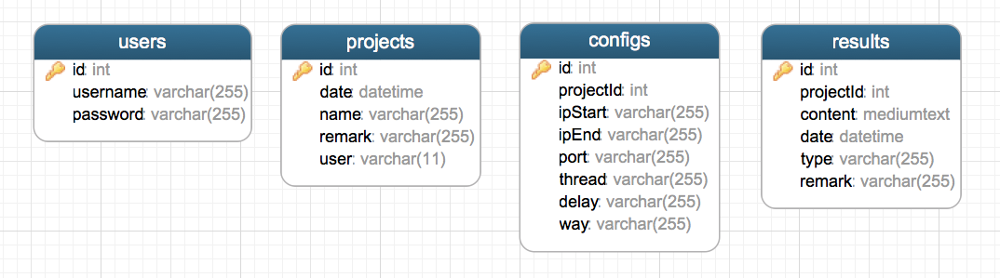

### 业务

* 用户注册与登录;
* 用户项目的增删改查;
* 项目配置的增删改查以及导出;
* 攻击配置的导出;
* 网络设备扫描结果与攻击结果的导入, 存储, 以及可视化拓扑图展示;

### 工作

* 选定前端框架, 还原设计;
* 拟订前后台交互接口;
* 设计数据库;
* 实现后台接口;
* 编写部署文档;

### 技术栈

* 前端: Vue + Vue Router + Element UI
* 后端: Node + Koa2 + MySQL
* 交互: axios

### 数据库



### 项目结构

* preview `topo/`

  ```
  blog
  ├── assets/
  ├── build/
  ├── config/
  ├── node_modules/
  ├── server/
  ├── src/
  ├── static/
  ├── .babelrc
  ├── .editorconfig
  ├── .gitignore
  ├── .postcssrc.js
  ├── index.html
  ├── package.json
  ├── package-lock.json
  ├── README.pdf
  └── README.md
  
  ```

* server `topo/server`

  ```
  server
  ├── controllers                                          # 控制层
  │   ├── config.js
  │   ├── project.js
  │   ├── result.js
  │   ├── topo.js
  │   └── user.js
  ├── models                                               # 模型层
  │   ├── config.js
  │   ├── project.js
  │   ├── result.js
  │   └── user.js
  ├── utils
  │   ├── check.js                                         # 检测用户登录状态
  │   ├── config.js                                        # 配置文件
  │   ├── controller.js                                    # 扫描controllers并注册URL
  │   └── db.js                                            # 数据库连接
  ├── view                                                 # 视图层
  └── app.js                                               # 程序入口
  ```

* frontend `topo/src`

  ```
  src
  ├── assets
  │   └── mockData.js                                      # 模拟后端数据
  ├── components
  │   ├── Breadcrumb.vue                                   # 后台管理
  │   ├── Categary.vue                                     # 后台内容添加发布
  │   ├── Config.vue                                       # 配置
  │   ├── Device.vue                                       # 拓扑图网络设备组件
  │   ├── Icon.vue                                         # 图标组件
  │   ├── Login.vue                                        # 登录
  │   ├── Project.vue                                      # 项目
  │   ├── Result.vue                                       # 扫描与攻击结果列表
  │   └── Topo.vue                                         # 拓扑图展示
  ├── router
  │   └── index.js                                         # 路由
  ├── App.vue
  └── main.js
  
  ```

### 环境部署

* 安装 [Node.js](https://nodejs.org/zh-cn/download/)

	验证安装

	```
	// 查看node版本
	node -v

	// 查看npm版本
	npm -v
	```

* 安装 [MySQL 5.7.22](https://dev.mysql.com/downloads/mysql/5.7.html#downloads)

	使用`Navicat`执行`SQL`脚本`topo/assets/topo.sql`

	或使用命令:

	```
	// 连接MySQL
	mysql -u root -p;

	// 新建数据库topo
	create database topo;

	// 选择数据库topo
	use topo;

	// 执行数据库脚本, 注意路径替换为实际路径
	source /topo/assets/topo.sql;
	```

	配置数据库连接`topo/server/utils/config.js`

	```
	...
	db: {
	  database: 'topo',   // 数据库名
	  username: '',       // 用户名
	  password: '',       // 密码
	  host: 'localhost',  // 地址
	  port: 3306          // 端口
	}
	...
	```

### 安装依赖与启动项目

* 安装`forever`

	```
	npm install forever -g
	```

* 安装依赖

	```
	// 进入项目
	cd topo

	// 安装依赖
	npm install

	```

* 编译前端代码

	```
	npm run build
	```
* 启动项目

	```
	npm start
	```

* 停止项目

	```
	npm stop
	```

* 修改端口

	默认监听3000端口, 修改端口则需要修改`topo/server/app.js`

	```
	...
	const PORT = 3000;
	...
	```

### 导入导出`json`格式说明

* 生成的扫描脚本`config.json`

	```
	[
	    {
	        "ipStart": "",  // 起始IP
	        "ipEnd": "",    // 终止IP
	        "port": "",     // 端口
	        "thread": "",   // 线程
	        "delay": "",    // 时延
	        "way": ""       // 策略
	    },
		...
	]
	```

* 生成的攻击脚本`attack.json`

	```
	[
	    {
	        "ip": "",  // 攻击IP
	        "port": "" // 攻击IP的端口
	    },
	    ...
	]
	```

* 导入的扫描结果`json`文件;

  格式可参考 `topo/assets/example.json`
  
	```
	[
	    {
	        "ip": "",                   // 网段IP
	        "devices": [                // 网段上设备数组
	            {
	                "ip": "",           // 设备IP
	                "port": [],         // 设备端口
	                "type": "",         // 设备类型: server服务器 , pc个人电脑
	                "os": "",           // 设备系统LOGO: linux, winOld , winNew
	                "version": "",      // 设备操作系统版本(linux 为空字符串)
	                "attacked": false   // 设备是否被攻击
	            },
	            ...
	        ]
	    },
	    {
	        "ip": "",
	        "devices": [
	            {
	                "ip": "",
	                "port": [],
	                "type": "",
	                "os": "",
	                "version": "",
	                "attacked": true
	            },
	            ...
	        ]
	    },
	    ...
	]
	```
	
### 接口文档

  ```
  // 前后台交互接口
  
  const API = [
  
    //--------------------登录--------------------------
    // 登录
    {
      url: '/login',
      type: 'POST',
      req: {
        username: '',
        password: ''
      },
      res: {
        result: 'success',
        msg: ''
      }
    },
  
    // 退出
    {
      url: '/logout',
      type: 'GET',
      res: {
        result: 'success',
        msg: ''
      }
    },
  
    // 状态检测
    {
      url: '/check',
      type: 'GET',
      res: {
        result: 'success',
        user: '',
        msg: ''
      }
    },
  
    // 注册
    {
      url: '/regist',
      type: 'POST',
      req: {
        username: '',
        password: ''
      },
      res: {
        result: 'success',
        msg: ''
      }
    },
  
  
    //--------------------项目--------------------------
    // 获取
    {
      url: '/project',
      type: 'GET',
      res: {
        result: 'success',
        projects: [
          {
            id: '',
            name: '',
            remark: '',
            user: '',
            date: ''
          },
        ]
      }
    },
  
    // 添加
    {
      url: '/project',
      type: 'POST',
      req: {
        name: '',
        remark: '',
        user: '',
        date: ''
      },
      res: {
        result: 'success',
        msg: ''
      }
    },
  
    // 修改
    {
      url: '/project',
      type: 'POST',
      req: {
        id: '',
        name: '',
        remark: '',
        user: '',
        date: ''
      },
      res: {
        result: 'success',
        msg: ''
      }
    },
  
    // 删除
    {
      url: '/project/ID',
      type: 'DELETE',
      res: {
        result: 'success',
        msg: ''
      }
    },
  
    //--------------------配置--------------------------
    // 获取
    {
      url: '/config',
      type: 'GET',
      req: 'projectID',
      res: {
        result: 'success',
        configs: [
          {
            id: '',
            ipStart: '',
            ipEnd: '',
            port: '',
            thread: '',
            delay: '',
            way: ''
          },
        ]
      }
    },
  
    // 添加
    {
      url: '/config',
      type: 'POST',
      req: {
        projectId: '',
        ipStart: '',
        ipEnd: '',
        port: '',
        thread: '',
        delay: '',
        way: ''
      },
      res: {
        result: 'success',
        msg: ''
      }
    },
  
    // 修改
    {
      url: '/config',
      type: 'POST',
      req: {
        id: '',
        ipStart: '',
        ipEnd: '',
        port: '',
        thread: '',
        delay: '',
        way: ''
      },
      res: {
        result: 'success',
        msg: ''
      }
    },
  
    // 删除
    {
      url: '/config/ID',
      type: 'DELETE',
      res: {
        result: 'success',
        msg: ''
      }
    },
  
    // 生成脚本
    {
      url: '/createScanJson',
      type: 'GET',
      req: 'projectID',
      res: {
        result: 'success',
        msg: ''
      }
    },
  
  
    //--------------------扫描与攻击结果-------------------
    // 根据ID获取扫描与攻击结果
    {
      url: '/result/ID',
      type: 'GET',
      res: {
        result: 'success',
        data: []
      }
    },
  
    // 上传扫描与攻击结果
    {
      url: '/uploadConfigJson',
      type: 'POST',
      res: {
        result: 'success',
        msg: ''
      }
    },
  
    // 上传扫描与攻击结果
    {
      url: '/getConfigData',
      type: 'GET',
      res: {
        result: 'success',
        topo: ''
      }
    },
  
    //--------------------拓扑图--------------------------
    // 生成攻击脚本
    {
      url: '/createAttackJson',
      type: 'POST',
      req: {},
      res: {
        result: 'success',
        msg: ''
      }
    },
  
    // 下载攻击脚本
    {
      url: '/downloadAttackJson',
      type: 'GET'
    },
  ]
  
  ```
 
### 预览
  

